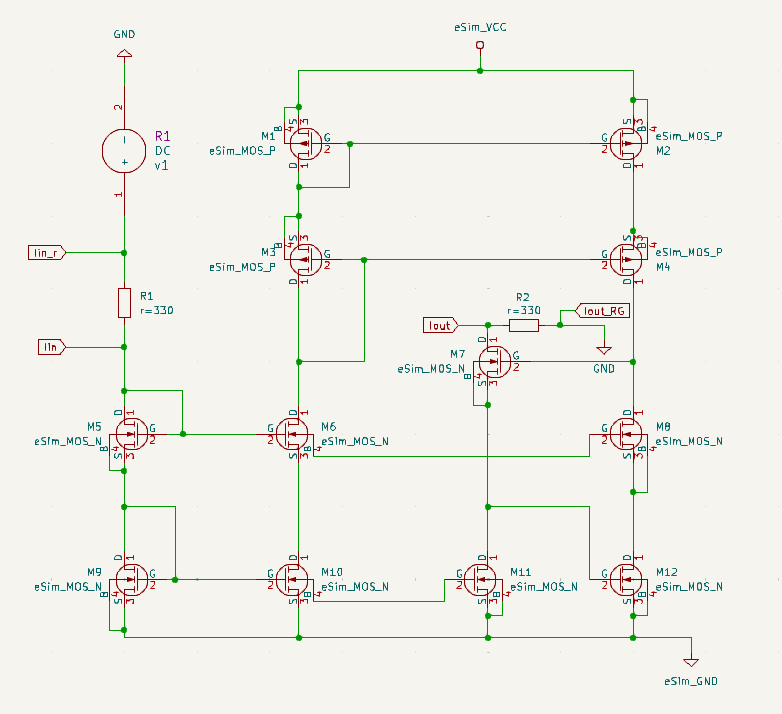
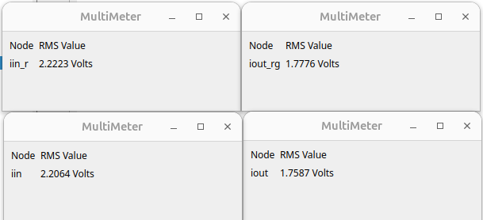

# Current Mirror Using eSim IHP OpenPDK

## 📘 Objective
The objective of this project is to **replicate current using a Current Mirror circuit** designed in **eSim** with **IHP-Open-PDK**, simulated in **Ngspice**, and drawn using **KiCad**.  
This experiment demonstrates the concept of current mirroring — where an output branch reproduces a reference current set by an input branch.

---

## ⚙️ Tools and Technologies
- **eSim** – Open-source EDA tool for circuit design and simulation  
- **IHP OpenPDK** – Process Design Kit used for MOSFET models  
- **Ngspice** – Simulation backend integrated with eSim  
- **KiCad** – Used for schematic capture and visualization  

---

## 🧩 Circuit Description
The designed circuit implements a **current mirror** using MOSFETs from the IHP OpenPDK library.  
- **MOS M5** acts as the **reference MOS**, setting the input current.  
- **MOS M7** acts as the **output MOS**, designed to replicate the reference current.  
- Two **330 Ω resistors (R1 and R2)** are connected in the reference and output branches respectively, to measure and verify the mirrored current.

### 🖼️ Schematic Diagram
Below is the circuit schematic of the Current Mirror:

---

## ⚡ Working Principle
A **current mirror** is a fundamental analog circuit used to copy a current from one branch to another.  
Here’s how it works:
1. The **reference current (Iref)** flows through MOS **M5**, setting up a gate-source voltage (VGS) common to both MOS.
2. The **output MOS (M7)** shares the same VGS and thus conducts a nearly identical current (**Iout ≈ Iref**).
3. The **ratio of output to reference current** can be controlled by the MOS size (W/L ratio), but in this design both are identical for unity mirroring.
4. Small deviations arise due to mismatch and channel-length modulation.

---

## 🧠 Simulation and Observation
The simulation was performed using **Ngspice** within eSim.  
Multimeters were used to measure node voltages across the resistors to calculate the branch currents.

| Node | Voltage (V) |
|------|-------------|
| iin_r | 2.2223 |
| iin | 2.2064 |
| iout_rg | 1.7776 |
| iout | 1.7587 |

### 🔹 Calculated Values
Using Ohm’s Law (V = IR) and resistor value R = 330 Ω:

\[
V_{R1} = 2.2223 - 2.2064 = 0.0159\text{ V}
\]
\[
I_{R1} = \frac{0.0159}{330} = 48.2\ \mu\text{A}
\]

\[
V_{R2} = 1.7776 - 1.7587 = 0.0189\text{ V}
\]
\[
I_{R2} = \frac{0.0189}{330} = 57.3\ \mu\text{A}
\]

| Parameter | Calculated Value |
|------------|------------------|
| Iref (Input Current) | 48.2 μA |
| Iout (Output Current) | 57.3 μA |

### ✅ Result
The output current closely matches the input current, validating the **current mirror operation** with a minor deviation due to device mismatch.

---

## 📊 Simulation Output
Measured voltage readings from eSim multimeters:

---

## 🧾 Conclusion
The **Current Mirror circuit** was successfully designed and simulated using **eSim-IHP-Open-PDK**.  
The simulation results confirm that the circuit effectively **mirrors the reference current** at the output branch with minimal deviation, demonstrating the fundamental operation of current replication in analog circuits.

---

